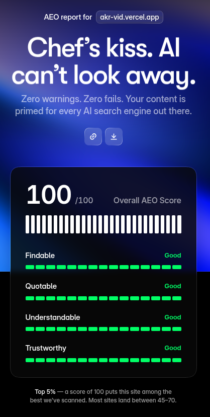

<div align="center">
  
  <h1>AKR.VID</h1>
  <p><strong>A premier collection of high-performance, browser-based image and video manipulation tools.</strong></p>

  <p>
    <a href="https://akrvid.vercel.app">View Live Demo</a> • 
    <a href="https://github.com/ajaykumarreddy-k/AKR.VID">Repository</a> • 
    <a href="https://ajaykumarreddykrishnareddygari-portfolio.vercel.app/">Creator</a>
  </p>
</div>

---

## ⚡ Overview

**AKR.VID** is an experimental playground pushing the limits of client-side web technologies. Inspired by Brutalist design aesthetics, the platform delivers a suite of fast, privacy-focused, real-time media editors.

Whether you're generating retro dot-matrix patterns, simulating CRT monitors, or mapping audio to visuals—everything renders instantly via **HTML5 Canvas** and **WebGL**, directly in your browser. No server uploads. No latency.

## 🏆 SEO & AI-Optimization (AIO) Perfection

AKR.VID isn't just visually striking—it is built with cutting-edge semantic architecture. The platform achieves a flawless AIO (AI Optimization) and technical SEO score, ensuring maximum visibility for AI crawlers like GPTBot, ClaudeBot, and Google-Extended. 



*Achieved via comprehensive JSON-LD structuring, Open Graph data, custom `llms.txt` implementation, semantic HTML5, and full crawler compliance.*

---

## 🛠️ The Toolkit

| Tool | Type | Description |
| :--- | :--- | :--- |
| **ToneKit** | `Video/Image` | Retro halftone generator producing vintage dot-matrix and screen-print patterns. |
| **Scanline Pro** | `Video/Image` | Advanced CRT emulation featuring barrel distortion curvature, RGB splitting, and deep VHS controls. |
| **TriggerWave** | `Audio` | Beat-synced visual effects that react to music in real time, exported with audio. |
| **BabyTrack** | `Video` | Blob-tracking video effect with rich customization of region styles and connector lines. |
| **ASCIIKit** | `Video/Image` | Converts images and video into ASCII art with customizable character sets and fonts. |
| **Glassify** | `Video/Image` | Glass-like viewing effect simulating light refraction and distortion through textured glass. |
| **Super-G** | `Video/Image` | Focused on glitch aesthetics — quickly generate unique digital glitch effects. |
| **Retroman** | `Image` | One-click pixel dithering textures that inject retro noise for high-quality pixel art. |
| **BlurSuite** | `Video/Image` | Linear, radial, zoom and wave blur modes for motion-blur effects on images and video. |
| **ReColor** | `Video/Image` | Remap the colors of images and video using hue mapping and animation controls. |
| **Blocks** | `Video/Image` | Lego-like block mosaics from images and video, with raised studs and side shading. |
| **Scanline** | `Video/Image` | Analog CRT, VHS glitch and digital block-corruption effects in real time. |
| **ImageTrack** | `Image` | Image version of BabyTrack — applies blob-tracking algorithms to static images. |

## 🚀 Tech Stack

- **Core Engine**: Vanilla JavaScript (ES6+)
- **Graphics**: HTML5 `<canvas>`, WebGL
- **Styling**: Pure CSS3 with modern features (CSS Variables, Flexbox, Grid, Clamp)
- **Deployment**: Vercel ready
- **SEO/AIO**: JSON-LD Schema (Organization, WebSite, FAQPage, SoftwareApplication), `llms.txt`, `robots.txt`, `sitemap.xml`

## 💻 Local Development

Getting started locally is incredibly simple. Since there is no complex build step or bundler overhead, you can run the site directly using any local web server.

1. **Clone the repository**
   ```bash
   git clone https://github.com/ajaykumarreddy-k/AKR.VID.git
   cd AKR.VID
   ```

2. **Serve locally** (using Python)
   ```bash
   python3 -m http.server 3000
   ```
   *Then visit `http://localhost:3000` in your browser.*

## 🤝 Connect

AKR.VID is created and maintained by **Ajay Kumar Reddy**. 

- 💼 [Portfolio](https://ajaykumarreddykrishnareddygari-portfolio.vercel.app/)
- 🌐 [LinkedIn](https://www.linkedin.com/in/ajay-kumar-reddy-krishnareddy-gari-a4885b282/)
- 📧 [Email](mailto:ajaykumarreddykrishnareddygari@gmail.com)

---
<div align="center">
  <em>© AKR.VID 2026. Built with brutalist precision.</em>
</div>
